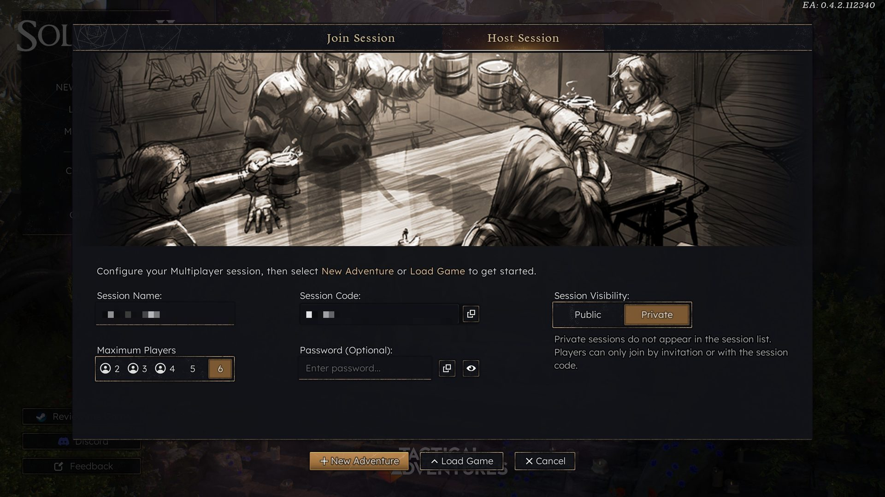
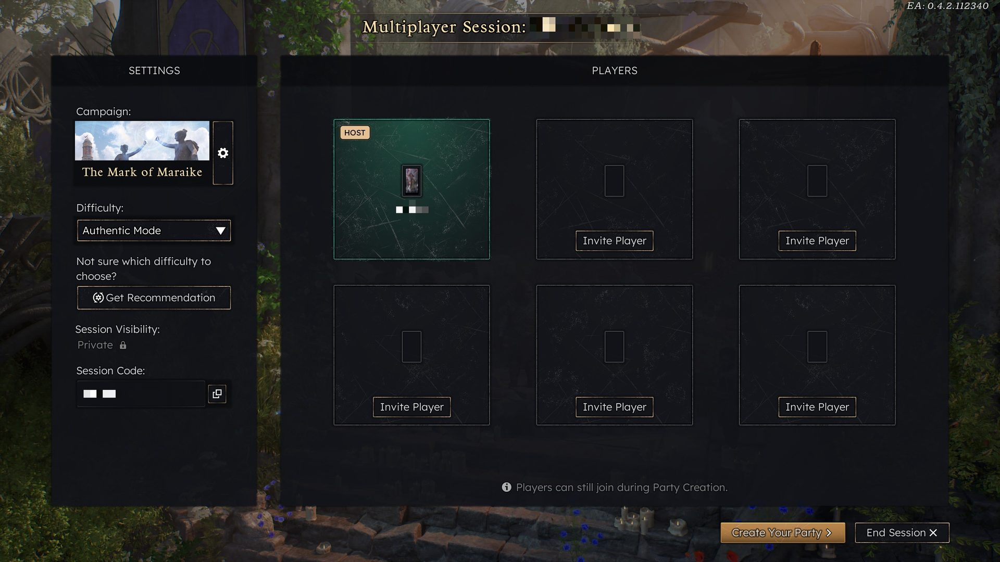
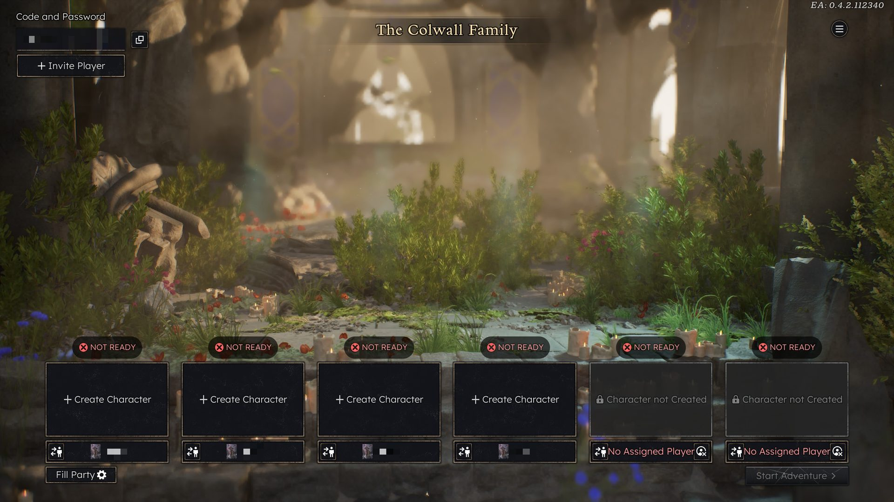

# BiggerParty — 6-hero parties and 6-player co-op for Solasta II

An unofficial mod for **Solasta II** (Early Access, builds CL-112340, CL-112436 and CL-113670 — the 21 Sep 2026 patch) that lets a new campaign have up to
six heroes and a hosted multiplayer lobby seat up to six players. Existing saves are untouched: a
4-hero save loads exactly as vanilla.

| Host screen: players 2–6 | Lobby: six seats | Party creation: six slots |
|---|---|---|
|  |  |  |

Also included, both optional: **GiveSpellbook**, a small fix for the multiplayer bug where multiclassing
into Wizard does not grant the spellbook, and **Narrator**, which reads the game's text-only world events
aloud with a neural voice (see below).

> Early Access caveat: every game patch can change the code this mod patches. The mod checks the game
> build at start-up and simply goes inert (with a note in `BiggerParty.log`) when it does not recognise
> it — it never modifies game files on disk and cannot corrupt saves.

## Install (one click)

1. Download `BiggerParty-x.y.zip` from the [Releases](../../releases) page and unzip it.
2. Close the game and run **`BiggerParty-Installer.exe`**. It finds Solasta II through Steam (or asks for
   the folder), installs the [UE4SS](https://github.com/UE4SS-RE/RE-UE4SS) script loader if you do not
   have it, and installs the mod. Press **Enter** for the default install, **s** to also get GiveSpellbook,
   **n** to also get the Narrator, **a** for both.
3. Start the game normally. Everyone in a multiplayer session installs the same way.

Uninstall: run the installer again and press **u**.

## In game

| | |
|---|---|
| New Campaign | six character slots |
| Multiplayer → Host | the *Players* selector offers 2–6; in party creation the extra slots start unassigned — joiners claim them, or the host takes them with the slot's assign button |
| **Ctrl+Shift+Tab** | toggle the mod on/off (applies to the next new campaign / lobby) |
| Inventory / character sheet | six portraits: Tab or click to switch hero |
| Story dialogues | work with six heroes (the mod keeps a participating hero in party slot 1 while a dialogue runs) |
| **Ctrl+Shift+End** | re-apply the UI tweaks on the current screen |
| **Ctrl+Shift+Backspace** | status report into `ue4ss\UE4SS.log` |
| **Ctrl+Shift+Up / Down** | enemy hit points +10% / −10% (see below; the Narrator, if installed, says the new value) |
| **Ctrl+Shift+F** | party heal: re-activates the formation manager, restarts follower AI, re-selects your hero |

Config: `<game>\Brimstone\Binaries\Win64\BiggerParty.ini` (`Enabled=1`, `PartySize=6`, up to 8 — the UI
was only tested with 6; `EnemyHitPointsPercent=100`; `CombatExperienceAsIfFour=1`). Logs: `BiggerParty.log` (native patcher), `ue4ss\UE4SS.log` (Lua; wiped at every launch) and
`BiggerParty-history.log` (the key lines, kept across launches — the one to send after a hang or crash).

GiveSpellbook (host / single player only): **Ctrl+Delete** grants a Wizard spellbook to any hero whose
spellcasting reports it missing; **Ctrl+Backspace** reports; **Ctrl+Shift+Delete** forces one on everyone
without a book.

## Narrator (optional)

World events — the text-only encounters on the road ("Voracious seagulls circle in the air…") — are not
voiced by the game. With the Narrator installed, the story text is read aloud as it appears on screen, and
the outcome after your choice is read too. Titles, the options, the choice you made and the reward lines
are deliberately left silent. Dialogue scenes are not narrated (they have their own voice acting).

| | |
|---|---|
| **Ctrl+Shift+N** | next voice — the new voice introduces itself so you can judge it; the choice is saved |
| **Ctrl+Shift+M** | mute / unmute |

The voices are Microsoft Edge's online neural voices (free, no account), so **the Narrator needs an
internet connection**; audio is cached in `<game>\Brimstone\Binaries\Win64\Narrator\cache`, so a line you have heard
plays instantly and offline. Fifteen English voices (Irish, British, Australian, American; Emily, Irish, is the default) are on the key;
any other Edge voice can be set as `Voice=` in `Narrator\narrator.ini`, along with `Rate=`, `Volume=` and
`Pitch=`. The narration is done by a small helper program, `Narrator\SolastaNarrator.exe`, that the mod
starts with the game and that exits when the game does (it is a packaged Python program — some antivirus
software is suspicious of those; it only reads the mod's queue file, talks to Edge's speech service and
plays audio). The Narrator is independent of the party size and works in single player and multiplayer
(each player hears their own narration).

## Enemy hit points

Six heroes make fights easier. `EnemyHitPointsPercent` in `BiggerParty.ini` (default `100`, 50–500) scales
the maximum hit points of hostile monsters: `150` gives them one and a half times their book value.
**Ctrl+Shift+Up / Ctrl+Shift+Down** change it in game by 10 and write it to the ini (the value persists between
sessions; with the Narrator installed the new value is spoken, otherwise it only shows in the log). The host applies it
(the values replicate to everyone else) to every hostile monster whose maximum is still the definition's,
so it also covers monsters that spawn later and saves loaded afterwards; damage already taken is kept.
Setting it back to `100` restores the monsters the mod changed; a monster raised under a different
percentage in an earlier session is left as it is. There is no row for it on the Difficulty screen yet.

## Experience with six heroes

The game pools a fight's XP (every hostile's challenge-rating value) and divides it by the number of
contenders on the party's side, so with six heroes each gets a sixth instead of a quarter — two-thirds
the levelling pace — and a guest fighting alongside (Jebfa) takes a share that goes nowhere. With
`CombatExperienceAsIfFour=1` (the default) the host tops every hero up to a four-hero share when a battle
ends, through the game's own XP grant, so the console shows the extra gain as a second line. `0` keeps
the game's split. Quest and world-event XP ("Each party member receives…") were never split.

## Known limitations

- **Family roles.** The early campaign scene where each sibling picks a family role has exactly four
  slots, so with six heroes the scene binds the *last four* party members and the other two sit it out.
  Everything proceeds normally; those two heroes simply hold no family role.
- **Dialogue participants.** Story scenes bind a fixed number of party participants, and the game routes
  the chosen option through party member #1. While a dialogue runs, the mod moves the first participating
  hero to slot #1 and possesses them, then restores the party order when the dialogue ends. You may notice
  the party strip reorder briefly during scenes.
- **Party following.** After story scenes the mod hands control back to the hero you had selected, through
  the game's own selection, so the party keeps following you. If a follower ever loses track of the leader
  and wanders, the mod notices within two seconds and re-selects your hero (you may see the selection flick
  to another hero and back once).
- **Multiplayer sessions.** Each player's followers follow that player's selected hero, and the mod only
  ever touches the heroes your own player state controls. In a story scene each player gets the dialogue
  through a hero of theirs that the scene bound; a scene binds a fixed set of participants, so with six
  heroes a player whose heroes were all left out sees no choice and does not vote. If a player drops and
  rejoins, the game hands their heroes around; if a scene then fails to open for someone, save and reload.
- **Followers stopping (game bug).** In the current Early Access build, party followers sometimes stop
  walking after a series of leader changes. It happens with four heroes and with the mod's script idle,
  so it is the game's; **save and reload** clears it. One cause the mod does fix: the game leaves its
  party-formation manager switched off after some loads, and the mod switches it back on within seconds.
  Ctrl+Shift+F applies the remaining known nudges by hand.
- **Item transfers.** The item menu's "Transfer to …" entries beyond the third did nothing (the game's handler
  was written for three receivers); the mod performs those transfers itself, for every player.
- **NPC guests** who travel with the party (the game's own guest members) get no portrait on the
  inventory strip and cannot receive items, as in the unmodded game.
- **Players versus heroes.** `PartySize` is the number of heroes; `MaxPlayers` (in `BiggerParty.ini`) is
  the number of human players a hosted session accepts and defaults to `PartySize`. Set `MaxPlayers=4` to
  keep the vanilla four-seat lobby with a six-hero party.

## How it works

Solasta II hard-codes its party size in exactly four places, all of them entry gates — the runtime
(party, HUD, combat, saves) already handles any number of heroes:

1. the character-creation level contains four `PartyAvatarSpawn` marker actors (one hero per marker),
2. `UGameSessionViewModel::SetupDefaultSession` builds four character slots (`mov r13d, 4`),
3. `CreateOnlineHostSessionRequest` tells the online service `MaxPlayerCount = 4`,
4. `ReadRuntimeSessionFromGameState` caps player slots at 4 when a saved game is re-hosted.

`version.dll` (a proxy loaded by the game exe) flips literals 2–4 in memory at start-up, locating each by
byte signature. The Lua half (UE4SS) spawns the extra markers, fits the extra cards on screen, widens the
creation camera, extends the host screen's players selector, re-flows the lobby tiles, extends the
inspection screen's portrait strip (extra portraits, selection ring, click), and owns the on/off toggle
(it rewrites the ini; the DLL's watcher thread follows within a second).

How it all works, and how to re-sign the patches after a game update: [docs/internals.md](docs/internals.md).

## Building from source

Requires Visual Studio 2022 Build Tools (C++ workload) and Python 3.

```
BiggerParty\build.bat                                  -> dist\version.dll
python BiggerParty\installer\gen_payload.py <UE4SS dir> -> stages the installer payload
BiggerParty\installer\build.bat                        -> dist\BiggerParty-Installer.exe
```

`<UE4SS dir>` is an extracted UE4SS *experimental* release (UE 5.6 support), i.e. the folder that
contains `dwmapi.dll` and `ue4ss\`. The Narrator's helper is built first with `Narrator\companion\build.bat`
(a Python venv with `edge-tts` and `pyinstaller`; see the script).

`tools\` holds the reverse-engineering helpers used to find the patch sites (PDB symbol/offset scanners,
a capstone-based disassembler, pak/utoc readers). After a game update, `pdb_pub.py` + `disasm.py` are how
the signatures get re-verified.

## Credits and license

Mod code: MIT (see `LICENSE`). Bundles [UE4SS](https://github.com/UE4SS-RE/RE-UE4SS) (MIT) in the
installer. Solasta II is © Tactical Adventures; this is an unofficial fan project, not affiliated with or
endorsed by Tactical Adventures or Kepler Interactive.
