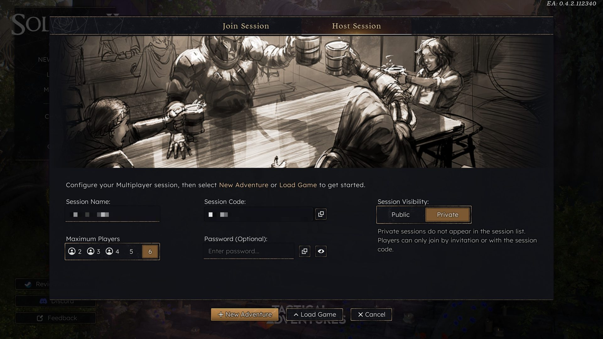
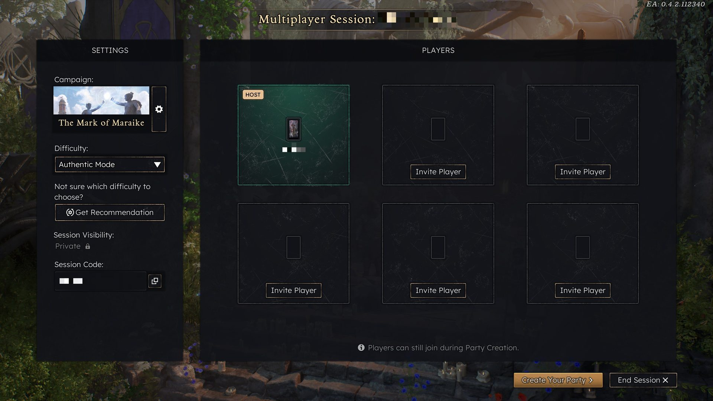
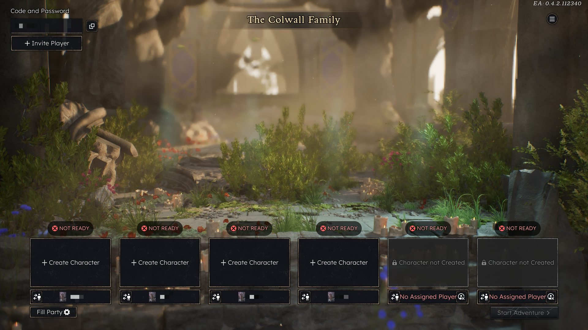

# BiggerParty — 6-hero parties and 6-player co-op for Solasta II

An unofficial mod for **Solasta II** (Early Access, builds CL-112340, CL-112436, CL-113670 and CL-114967 — the 1 Oct 2026 patch) that lets a new campaign have up to
six heroes and a hosted multiplayer lobby seat up to six players. Existing saves are untouched: a
4-hero save loads exactly as vanilla.

| Host screen: players 2–6 | Lobby: six seats | Party creation: six slots |
|---|---|---|
|  |  |  |

Also included: the **Narrator**, which reads the game's text-only world events aloud with a full cast of
recorded voices (see below), and, optional, the **Kobold race**: a playable kobold with a voice of its own
in cutscenes (see below).

> Early Access caveat: every game patch can change the code this mod patches. The mod checks the game
> build at start-up and simply goes inert (with a note in `BiggerParty.log`) when it does not recognise
> it — it never modifies game files on disk and cannot corrupt saves.

## Install (one click)

1. Download `BiggerParty-x.y.zip` from the [Releases](../../releases) page and unzip it.
2. Close the game and run **`BiggerParty-Installer.exe`**. It finds Solasta II through Steam (or asks for
   the folder), installs the [UE4SS](https://github.com/UE4SS-RE/RE-UE4SS) script loader if you do not
   have it, and installs the mod. Press **Enter** for the default install (BiggerParty and the Narrator),
   **k** to also get the Kobold race, or **n** for BiggerParty without the Narrator.
3. Start the game normally. Everyone in a multiplayer session installs the same way.

Uninstall: run the installer again and press **u**.

## In game

| | |
|---|---|
| **Mod options** (title screen and pause menu, after Settings) | the mod's version (click it to see every player's in a multiplayer session) and its settings as menu buttons, each showing its value: a click changes it (the mod on/off, party size, players, enemy hit points +10% / −10%, four-hero XP, Narrator on/off and volume, and with the Kobold race installed, the race on/off and the kobold voice); **Back** returns to the menu |
| New Campaign | six character slots |
| Multiplayer → Host | the *Players* selector offers 2–6; in party creation the extra slots start unassigned — joiners claim them, or the host takes them with the slot's assign button |
| **Ctrl+Shift+Tab** | toggle the mod on/off (applies to the next new campaign / lobby) |
| Inventory / character sheet | six portraits: Tab or click to switch hero |
| Story dialogues | work with six heroes (the mod keeps a participating hero in party slot 1 while a dialogue runs) |
| **Ctrl+Shift+End** | re-apply the UI tweaks on the current screen |
| **Ctrl+Shift+Backspace** | status report into `ue4ss\UE4SS.log` |
| **Ctrl+Shift+Up / Down** | enemy hit points +10% / −10% (see below) |
| **Ctrl+Shift+F** | party heal: re-activates the formation manager, restarts follower AI, re-selects your hero |

Version check: in multiplayer every player's BiggerParty tells the host its version after each load, and the
host answers with its own. A player on a different version, or on one that does not report (before 1.4.13, or
no BiggerParty), gets a message in the game's information dialog, and the line goes to the history log. The
Kobold race counts as part of the version (it reads `1.5.0+kobold` while the race is on), so everyone in a
session needs the same setting.

Config: `<game>\Brimstone\Binaries\Win64\BiggerParty.ini` (`Enabled=1`, `PartySize=6`, up to 8 — the UI
was only tested with 6; `EnemyHitPointsPercent=100`; `CombatExperienceAsIfFour=1`). Logs: `BiggerParty.log` (native patcher), `ue4ss\UE4SS.log` (Lua; wiped at every launch) and
`BiggerParty-history.log` (the key lines, kept across launches — the one to send after a hang or crash).

GiveSpellbook was retired in 1.5.0: the game fixed the multiclass spellbook bug it worked around. The
installer offers to remove an old copy.

## Narrator

World events — the text-only encounters on the road — are not voiced by the game. The Narrator reads them
aloud with a full cast of recorded voices: a narrator, and a voice of its own for each character who speaks.
The story text is read as it appears on screen, and the outcome after your choice is read too; titles, the
options, the choice you made and the reward lines are deliberately left silent, and dialogue scenes are not
narrated (they have their own voice acting). Picking an option moves the narration straight on to the
outcome, and closing an event stops it at once.

| | |
|---|---|
| **Ctrl+Shift+M** | mute / unmute |
| **Ctrl+Shift+= / Ctrl+Shift+-** | narration louder / quieter in 10% steps (10–100%, saved; a chime plays at the new level) |

The game's 131 world events have 490 passages (about 100 minutes), and all of them are recorded. The
recordings are made with Google's Gemini text-to-speech from the game's own text (written by Tactical
Adventures and, for some events, by the community), installed in
`<game>\Brimstone\Binaries\Win64\Narrator\pack` and matched to the passage on screen, tolerant of small
wording changes from game patches, starting while the text is still being typed; a line without a
recording (text a later patch adds) is not read. No internet
connection is needed. The narration is played by a small helper program, `Narrator\SolastaNarrator.exe`,
that the mod starts with the game and that exits when the game does (it is a packaged Python program —
some antivirus software is suspicious of those; it only reads the mod's queue file and plays audio).
Settings are in `Narrator\narrator.ini` (`Enabled`, `PlaybackVolume`). The Narrator is independent of the
party size and works in single player and multiplayer (each player hears their own narration). The
installer installs it by default; **n** in its menu leaves it out. How it works:
[the Narrator in the internals](docs/internals.md#narrator-voicing-the-world-events).

## Kobold race (optional)

**k** in the installer adds a playable kobold. Pick **Kobold** among the ancestries in character creation:
the hero looks like the game's own kobolds, carries its weapons and gear, and has two traits of its own:

- **Draconic Cry** (bonus action): until the start of your next turn, you and your allies have advantage on
  attack rolls against the enemies within 10 feet of you. Uses equal to your proficiency bonus, regained
  after a long rest.
- **Kobold Legacy**, one of three: **Craftiness** (proficiency in Arcana, Investigation, Medicine, Sleight
  of Hand or Survival), **Defiance** (advantage on saving throws to avoid or end being frightened) or
  **Draconic Sorcery** (a cantrip from the Sorcerer spell list).

In cutscenes a kobold hero's lines are spoken in a kobold voice: 414 recorded lines so far, made with
ElevenLabs from the game's own text and played by the Narrator's helper, so the voice needs the Narrator.
A line without a recording keeps the game's voice. The recordings ship in the installer, not in this
repository.

| | |
|---|---|
| **Mod options → Kobold race** | on / off, from the next start (while it is off, kobold heroes show as gnomes) |
| **Mod options → Kobold voice** | each click steps the kobold voice down, 50% to 10%, then back to 50% |
| **Ctrl+Shift+, / Ctrl+Shift+.** | kobold voice quieter / louder |

Settings: `Kobold.ini` next to the game exe (`Enabled`, `VoiceLevel`); log: `Kobold.log`. The race adds an
ancestry to the game's rules, so everyone in a multiplayer session needs the same setting (see the version
check above). Under the hood the kobold is the game's hidden gnome ancestry, shown on the game's kobold
model; only heroes change, so NPCs the game draws on the gnome body keep their own look.

## Enemy hit points

Six heroes make fights easier. `EnemyHitPointsPercent` in `BiggerParty.ini` (default `100`, 50–500) scales
the maximum hit points of hostile monsters: `150` gives them one and a half times their book value.
**Ctrl+Shift+Up / Ctrl+Shift+Down** change it in game by 10 and write it to the ini (the value persists between
sessions and shows in the log). The host applies it
(the values replicate to everyone else) to every hostile monster whose maximum is still the definition's,
so it also covers monsters that spawn later and saves loaded afterwards; damage already taken is kept.
Setting it back to `100` restores the monsters the mod changed; a monster raised under a different
percentage in an earlier session is left as it is. There is no row for it on the Difficulty screen yet.

## Experience with six heroes

The game pools a fight's XP (every hostile's challenge-rating value) and divides it by the number of
contenders on the party's side, so with six heroes each gets a sixth instead of a quarter — two-thirds
the levelling pace. Companions fighting alongside (story guests such as Jebfa, summons) take a share too,
which goes nowhere. With `CombatExperienceAsIfFour=1` (the default) the host tops every hero up, when a
battle ends, to what it would get in a party of four heroes with the same companions, through the game's
own XP grant, so the console shows the extra gain as a second line. A party of four heroes or fewer gets
nothing added. `0` keeps the game's split. Quest and world-event XP ("Each party member receives…") were
never split.

## Known limitations

- **Family roles.** The early campaign scene where each sibling picks a family role has exactly four
  slots, so with six heroes the scene binds the *last four* party members and the other two sit it out.
  Everything proceeds normally; those two heroes simply hold no family role.
- **Dialogue participants.** Story scenes bind a fixed number of party participants, and the game routes
  the chosen option through party member #1. While a dialogue runs, the mod moves the first participating
  hero to slot #1 and possesses them, then restores the party order when the dialogue ends. You may notice
  the party strip reorder briefly during scenes.
- **Party following.** After story scenes the mod hands control back to the hero you had selected, through
  the game's own selection, so the party keeps following you. If a follower ever loses track of the leader
  and wanders, the mod notices within two seconds and re-selects your hero (you may see the selection flick
  to another hero and back once).
- **Multiplayer sessions.** Each player's followers follow that player's selected hero, and the mod only
  ever touches the heroes your own player state controls. In a story scene each player gets the dialogue
  through a hero of theirs that the scene bound; a scene binds a fixed set of participants, so with six
  heroes a player whose heroes were all left out sees no choice and does not vote. When the hero a player
  has selected is not in the scene but another of theirs is, the host hands them that hero for the scene;
  now and then the hand-over arrives too late, and that player sees the scene without the choices. Each
  choice then waits about 30 seconds for their vote before it goes on. If a player drops and rejoins, the
  game hands their heroes around; if a scene then fails to open for someone, save and reload.
- **A turn that cannot be ended (multiplayer).** Now and then a player's End Turn does nothing, while the host
  can end that turn, and handing the hero to the host and back (the session screen's take and give) clears it.
  The mod does that by itself: the stuck player's copy notices it (End Turn clicked and the turn still running a
  few seconds later, or half a minute of their turn with no usable End Turn) and asks the host's copy, which
  hands the hero over and back; the host also does it for a hero the game moved from one player straight to
  another after a load. **Mod options → Fix a stuck turn** asks for it by hand. Both the player and the host need
  1.4.14 or later. If it still happens, kick and let the player rejoin, or reload. Every machine logs each party
  member's turn to `BiggerParty-history.log`; send that file from the stuck player's game folder.
- **Followers stopping (game bug).** In the current Early Access build, party followers sometimes stop
  walking after a series of leader changes. It happens with four heroes and with the mod's script idle,
  so it is the game's; **save and reload** clears it. One cause the mod does fix: the game leaves its
  party-formation manager switched off after some loads, and the mod switches it back on within seconds.
  Ctrl+Shift+F applies the remaining known nudges by hand.
- **Item transfers.** The item menu's "Transfer to …" entries beyond the third did nothing (the game's handler
  was written for three receivers); the mod performs those transfers itself, for every player.
- **NPC guests** who travel with the party (the game's own guest members) get no portrait on the
  inventory strip and cannot receive items, as in the unmodded game.
- **Players versus heroes.** `PartySize` is the number of heroes; `MaxPlayers` (in `BiggerParty.ini`) is
  the number of human players a hosted session accepts and defaults to `PartySize`. Set `MaxPlayers=4` to
  keep the vanilla four-seat lobby with a six-hero party.

## How it works

Solasta II hard-codes its party size in exactly four places, all of them entry gates — the runtime
(party, HUD, combat, saves) already handles any number of heroes:

1. the character-creation level contains four `PartyAvatarSpawn` marker actors (one hero per marker),
2. `UGameSessionViewModel::SetupDefaultSession` builds four character slots (`mov r13d, 4`),
3. `CreateOnlineHostSessionRequest` tells the online service `MaxPlayerCount = 4`,
4. `ReadRuntimeSessionFromGameState` caps player slots at 4 when a saved game is re-hosted.

`version.dll` (a proxy loaded by the game exe) flips literals 2–4 in memory at start-up, locating each by
byte signature. The Lua half (UE4SS) spawns the extra markers, fits the extra cards on screen, widens the
creation camera, extends the host screen's players selector, re-flows the lobby tiles, extends the
inspection screen's portrait strip (extra portraits, selection ring, click), and owns the on/off toggle
(it rewrites the ini; the DLL's watcher thread follows within a second).

How it all works, and how to re-sign the patches after a game update: [docs/internals.md](docs/internals.md).

## Building from source

Requires Visual Studio 2022 Build Tools (C++ workload) and Python 3.

```
BiggerParty\build.bat                                  -> dist\version.dll
python BiggerParty\installer\gen_payload.py <UE4SS dir> -> stages the installer payload
BiggerParty\installer\build.bat                        -> dist\BiggerParty-Installer.exe
```

`<UE4SS dir>` is an extracted UE4SS *experimental* release (UE 5.6 support), i.e. the folder that
contains `dwmapi.dll` and `ue4ss\`. The Narrator's helper is built first with `Narrator\companion\build.bat`
(a Python venv with `pyinstaller`; see the script), and the voice pack goes in `Narrator\pack` (not in the
repository: it is the game's text read aloud). The Kobold race is `Kobold\Scripts\main.lua` with its default
`Kobold.ini`; its voice (an add-on pack of the Narrator's: `index.json`, `lines.txt`, `roles.txt` and the
recordings) goes in `Kobold\pack`, likewise not in the repository.

`tools\` holds the reverse-engineering helpers used to find the patch sites (PDB symbol/offset scanners,
a capstone-based disassembler, pak/utoc readers). After a game update, `pdb_pub.py` + `disasm.py` are how
the signatures get re-verified.

## Credits and license

Mod code: MIT (see `LICENSE`). Bundles [UE4SS](https://github.com/UE4SS-RE/RE-UE4SS) (MIT) in the
installer. Solasta II is © Tactical Adventures; this is an unofficial fan project, not affiliated with or
endorsed by Tactical Adventures or Kepler Interactive.
